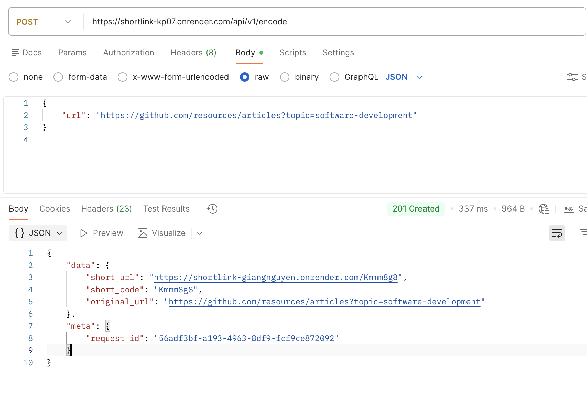
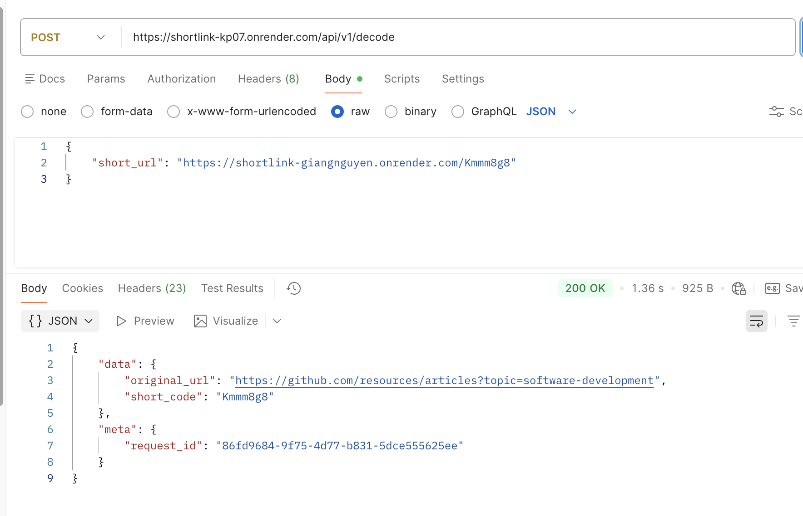

## 1. Setup & Installation

### Prerequisites
- Docker & Docker Compose

### Getting Started

1. Clone the repository & start the containers
```bash
git clone <repo-url> && cd shortlink
cp .env.example .env
docker-compose up -build -d
```

2. Prepare the database
```bash
docker-compose exec web bin/rails db:prepare
```

```bash
bundle exec rails db:drop db:create db:migrate
```

3. Run the test suite (RSpec)
```bash
docker-compose exec web bundle exec rails db:test:prepare
```

```bash
docker-compose exec web bundle exec rspec
```

```bash
docker-compose exec web bundle exec rspec spec/services/url_decoder_service_spec.rb
```

4. Some command to use
```bash
docker-compose logs -f web

docker-compose exec web bundle exec rails c
```

## 2. Live Demo
The application is fully deployed and available for testing!

**Base URL:** `https://shortlink-kp07.onrender.com`

- This demo is hosted on Render's Free tier and uses an Upstash Serverless Redis. The free instance will spin down with inactivity. If the service hasn't been accessed recently, **the very first request may be delayed by 50 seconds or more** while the container wakes up. Subsequent requests will be lightning-fast.

You can test the Encode endpoint directly from your terminal

2.1 Encode a URL
```bash
curl -X POST https://shortlink-kp07.onrender.com/api/v1/encode \
  -H "Content-Type: application/json" \
  -d '{"url": "https://docs.github.com/en/integrations/concepts/about-integrations"}'
```

2.1 Decode a short URL
```bash
curl -X POST https://shortlink-kp07.onrender.com/api/v1/decode \
  -H "Content-Type: application/json" \
  -d '{"short_url": "https://shortlink-kp07.onrender.com/Kmmm1TI"}'
```

### Successful Response Example
**Encode API:**


**Decode API:**



## 3. API Documentation

### `POST /api/v1/encode` — Encode a URL

**Request:**

```bash
{
  "url": "https://github.com/resources/articles?topic=software-development"
}
```


```bash
curl -X POST http://localhost:3000/api/v1/encode \
  -H "Content-Type: application/json" \
  -d '{"url": "https://github.com/resources/articles?topic=software-development"}'
```

**Response `201 Created`:**
```json
{
  "data": {
    "short_url": "http://localhost:3000/Kmmm1ZE",
    "short_code": "Kmmm1ZE",
    "original_url": "https://github.com/resources/articles?topic=software-development"
  },
  "meta": { "request_id": "8eea66d8-7be9-41f6-832f-29ed5a586662" }
}
```

### `POST /api/v1/decode` — Decode a short URL

**Request** (accepts full URL **or** just the code):
```bash
curl -X POST http://localhost:3000/api/v1/decode \
  -H "Content-Type: application/json" \
  -d '{"short_url": "http://localhost:3000/Kmmm1ZE"}'
```

```bash
curl -X POST http://localhost:3000/api/v1/decode \
  -H "Content-Type: application/json" \
  -d '{"short_url": "Kmmm1ZE"}'
```

**Response `200 OK`:**
```json
{
  "data": {
    "original_url": "https://github.com/resources/articles?topic=software-development",
    "short_code": "Kmmm1ZE"
  },
  "meta": { "request_id": "62f3a771-739f-4b26-8886-d4684cc7cfb1" }
}
```


## 4. Architectural Approach & The Collision Problem

### 4.1 The Collision Problem

A naive approach to URL shortening generates a random short code and checks the database for uniqueness. Under high concurrency this breaks down in three ways:

- **Race Conditions** — two concurrent requests generate the same code simultaneously and both pass the uniqueness check before either writes to the database.
- **Birthday Paradox** — with Base62 and a 7-character code (62⁷ ≈ 3.5 trillion combinations), collision probability grows non-linearly. After ~2.3 million entries the probability of at least one collision exceeds 50%.
- **Retry Amplification** — each collision requires a retry, which in turn requires another DB read. Under load, this creates a write-heavy, lock-contended hot path.

### 4.2 Solution: Key Generation Service (KGS) with PostgreSQL Sequence

This application eliminates collisions entirely through **pre-allocation** rather than random generation.

**Step 1 — Atomic ID source (PostgreSQL SEQUENCE)**

```sql
-- Atomic, monotonically increasing, never returns the same value twice
SELECT nextval('short_url_counter')
FROM generate_series(1, 20000);
```

A PostgreSQL SEQUENCE is guaranteed atomic at the database level. Even under extreme concurrency, two transactions will never receive the same `nextval`. This is the mathematical foundation of collision-freedom.

**Step 2 — Base62 encoding + shuffle**

Each sequence integer is encoded to Base62 (characters `0-9a-zA-Z`) giving a compact, URL-safe string. The batch is then **shuffled** before storage so consecutive requests produce visually unpredictable codes — preventing enumeration attacks.

```
nextval: 1,000,000  →  Base62: "4c92"  →  stored in Redis pool (shuffled order)
```

**Step 3 — Redis Key Pool (O(1) hot path)**

`KeyGenerationService` stores the pre-generated batch as a Redis List (`RPUSH`). When `/encode` is called, it pops one key instantly (`LPOP`) — **zero database queries** on the hot path.

**Step 4 — Asynchronous Replenishment**

When the Redis pool drops below a configurable threshold (default: 5,000 keys), a background thread triggers a new batch fetch. This thread is guarded by a **Redis `SET NX` distributed lock** (10-second TTL) to ensure only one server replenishes at a time, even in a multi-instance deployment.

```
Pool size > 5,000  →  no action (non-blocking check, O(1))
Pool size < 5,000  →  acquire NX lock  →  generate 20,000 new keys  →  release lock
```

**Step 5 — Redis Failure Fallback**

If Redis is unavailable, the KGS falls back to `SecureRandom.alphanumeric(7)` with a retry loop bounded by the database `UNIQUE` constraint on `short_code`. This guarantees the service stays functional — at reduced performance — even with Redis completely down.

**Step 6 — Idempotency via SHA-256 Digest**

If the same long URL is submitted multiple times, it must return the same short code. A full-text B-Tree index on `VARCHAR(2048)` is expensive. Instead, the application computes `SHA256(url.downcase)` — a fixed-length 64-character hex string — and stores it as `url_digest` with a `UNIQUE INDEX`. This gives O(log n) idempotency lookup at constant index size, regardless of URL length.

| Property | Guarantee |
|---|---|
| Collision rate | **0%** — SEQUENCE never repeats |
| Idempotency | **SHA-256 digest** unique index — same URL → same code |
| Hot-path latency | **O(1)** — Redis LPOP, no DB query |
| Concurrency safety | `RecordNotUnique` rescue handles the rare race condition |

---

## 5. Security & Attack Vectors

### 5.1 Attack Vector Map

| Attack | Risk | Mitigation (Current) | Mitigation (Proposed) |
|---|---|---|---|
| **SSRF** | Probe internal services via crafted URLs | `UrlValidator` blocks RFC 1918, loopback, link-local IPs | Enable `check_ssrf: true` in model; async DNS re-validation post-encode |
| **DDoS / Flood** | Overwhelm DB with bulk encode requests | `rack-attack` — 10 encode/min, 30 decode/min per IP | Move to Cloudflare WAF at the edge; API Gateway throttling per API key |
| **Brute-force Enumeration** | Sequentially guess short codes to discover URLs | KGS shuffles before storage → non-sequential codes | Add auth on decode; rate-limit per code |
| **SQL Injection** | Malicious input in `short_url` parameter | Strong params + Base62 regex `/\A[0-9a-zA-Z]+\z/` + parameterized queries | — (already robust) |
| **Open Redirect Abuse** | Redirect users to phishing/malware sites | HTTP/HTTPS scheme whitelist only | Google Safe Browsing API scan on encode; warning interstitial page |
| **Cache Poisoning** | Poison decode cache with wrong URL | Cache key = `sha256(url)` — not user-controlled; `short_code` is immutable | — (by design) |
| **Thundering Herd (click tracking)** | Row-level lock on `click_count` under high concurrency | `increment!` avoided; Redis INCR planned (Phase 2) | Sidekiq cron job batch-flushes Redis counters to DB every 5 min |
| **Parameter Tampering** | Forge `short_code` format | `Base62Encoder.valid_code?` validates before any DB query | — (already in place) |

### 5.2 SSRF — Deep Dive

**Threat**: An attacker submits `http://169.254.169.254/latest/meta-data/` (AWS Instance Metadata) or `http://10.0.0.1` (internal network). The shortener naively persists it, and any decode-redirect exposes the internal response.

**Current mitigation** (`UrlValidator`):
```ruby
PRIVATE_IP_RANGES = [
  IPAddr.new('10.0.0.0/8'),       # RFC 1918 Class A
  IPAddr.new('172.16.0.0/12'),    # RFC 1918 Class B
  IPAddr.new('192.168.0.0/16'),   # RFC 1918 Class C
  IPAddr.new('127.0.0.0/8'),      # Loopback
  IPAddr.new('169.254.0.0/16'),   # Link-local (AWS metadata!)
  IPAddr.new('::1/128'),          # IPv6 loopback
  IPAddr.new('fc00::/7'),         # IPv6 unique local
].freeze
# Resolves DNS and rejects any IP in these ranges
```

**Known limitation**: DNS rebinding — a host resolves to a public IP at validation time but switches to an internal IP afterward. **Proposed fix**: re-validate the resolved IP at redirect time (inside `RedirectsController`).

### 5.3 Rate Limiting — Multi-Layer Strategy

The current single-layer `rack-attack` approach is not accurate across multiple Puma processes because it uses an in-process store. The proposed multi-layer defence:

```
L1 — Edge (Cloudflare WAF)         → blocks malicious IPs/ASNs before reaching the server
L2 — API Gateway (Kong)            → per API-key throttling (1,000 req/min per app)
L3 — Application (rack-attack)     → per-IP limits using Redis store (accurate, shared)
L4 — Database (PgBouncer)          → connection pool cap prevents DB saturation
```

For `rack-attack` to be accurate in a multi-process/multi-instance setup, point it to the shared Redis store:

```ruby
Rack::Attack.cache.store = ActiveSupport::Cache::RedisCacheStore.new(
  url: ENV['REDIS_URL'],
  namespace: 'rack_attack'
)
```

### 5.4 Security Response Headers

Every response includes hardening headers set in `ApplicationController`:

```
X-Content-Type-Options: nosniff
X-Frame-Options: DENY
X-XSS-Protection: 1; mode=block
Referrer-Policy: strict-origin-when-cross-origin
```

---

## 6. Scalability — Current Limitations & 3-Tier Evolution

### Current Limitations

| Component | Limitation | Impact |
|---|---|---|
| **Single Redis node** | No replication or failover | Redis crash = KGS pool lost + cache gone + rate limit bypassed |
| **Synchronous DB write on encode** | Each `/encode` waits for `INSERT` to commit | At 10k RPS encode → 10k INSERT/s → DB saturation |
| **Single PostgreSQL instance** | No read replicas | Read and write traffic compete for the same I/O budget |
| **In-process KGS thread** | `Thread.new` inside Puma dies on process restart | Key pool not replenished until next request triggers it |
| **rack-attack in-process store** | Per-worker, not shared | Rate limit count is divided across workers — effectively N× looser than configured |
| **No async write path** | `/encode` is synchronous end-to-end | Cannot absorb traffic spikes; latency tied to DB write latency |

---

### Tier 1 — Current Architecture 

```
Clients  →  Nginx (reverse proxy)  →  Rails / Puma (1 instance)
                                          ├──  PostgreSQL  (single node, reads + writes)
                                          └──  Redis       (single node, KGS + cache + rate limit)
```

**Strengths**: Simple to operate, zero infrastructure overhead, already handles moderate load via 3-level caching and KGS.

**Bottlenecks**: Single points of failure on both Redis and PostgreSQL; synchronous write path; in-process KGS thread not fault-tolerant.

---

### Tier 2 — Medium Scale 

```
Clients  →  Cloudflare (WAF, DDoS, rate limit)
         →  AWS ALB (load balancer)
         →  Rails / Puma (N instances, auto-scaled)
               ├── Redis Cluster  (3 primary + 3 replica, Sentinel auto-failover)
               ├── PostgreSQL Primary  (all writes)
               ├── PostgreSQL Read Replicas  (all decode reads)
               └── Sidekiq Workers  (KGS replenishment, click-count flush)
```

**Key changes from Tier 1**:

- **Redis Cluster + Sentinel**: automatic failover in under 30 seconds. Decode cache, encode cache, and KGS pool are sharded across multiple primaries.
- **PostgreSQL Primary + Read Replicas**: `/encode` writes to the primary; `/decode` reads from replicas. Separates read and write I/O budgets.
- **Sidekiq replaces `Thread.new`**: KGS replenishment becomes a persistent, monitored, retryable background job — survives process restarts and server crashes.
- **Cloudflare at the edge**: rate limiting, WAF, and DDoS protection are offloaded from the Rails application entirely.
- **`rack-attack` → shared Redis store**: accurate rate limiting across all Puma processes and instances.

**Redis failure handling in Tier 2**:
- Sentinel detects primary failure and promotes a replica automatically.
- During the failover window (~10–30s): encode cache miss → L2 PostgreSQL lookup (slower but correct); KGS uses `SecureRandom` fallback.

---

### Tier 3 — Hyper Scale 

```
Clients  →  Cloudflare Workers (edge decode cache — <5ms globally)
         →  API Gateway / Kong (auth, per-key throttling, routing)
               ├── Encode Service  (stateless pods, K8s HPA)
               │     ├── pop key from KGS Service (gRPC)
               │     ├── write encode/decode cache to Redis Cluster
               │     └── publish event to Kafka  →  201 Created (no DB wait)
               │
               ├── Decode Service  (stateless pods, K8s HPA)
               │     ├── L1: Redis Cluster (sharded by short_code)
               │     └── L2: PostgreSQL Read Replica (geo-distributed)
               │
               └── KGS Microservice  (dedicated, isolated scaling)
                     ├── maintains Redis key pool
                     └── queries PostgreSQL SEQUENCE in large batches

Kafka  →  Batch Writer Consumers  →  PostgreSQL Primary
             (INSERT 10,000 rows per transaction)
             (at-least-once delivery; idempotent via url_digest UNIQUE index)
```

**Key changes from Tier 2**:

**Async Write Path (Encode)**

The `/encode` endpoint no longer waits for a database `INSERT`. The flow becomes:
1. Pop key from KGS (Redis LPOP — O(1))
2. Write to encode and decode Redis caches immediately
3. Publish `{short_code, original_url, url_digest}` to Kafka
4. Return `201 Created` to the client

Kafka consumers batch-insert records into PostgreSQL (`10,000 rows/transaction`). Idempotency is preserved by the `UNIQUE INDEX` on `url_digest` — duplicate Kafka messages are silently discarded via `ON CONFLICT DO NOTHING`.

**Edge Decode Cache**

`GET /:short_code` and `POST /decode` for viral links are served entirely from Cloudflare's Edge KV store — without ever reaching the Ruby backend. The CDN is pre-warmed on encode.

**KGS as a Microservice**

With multiple Encode Service pods, a single shared KGS microservice (exposing a gRPC `PopKey()` RPC) manages the Redis key pool. This eliminates the distributed lock complexity inside each Rails process.

**Database Sharding**

When a single PostgreSQL primary can no longer sustain write throughput, the `short_urls` table is horizontally partitioned by `hash(short_code) % N_SHARDS`. Because `KeyGenerationService` assigns keys independently (not via auto-increment primary keys), cross-shard ID conflicts are impossible.

### 6.1 Collision Problem at Scale

The collision strategy adapts across tiers:

| Tier | Strategy | Collision Rate |
|---|---|---|
| 1 (current) | PostgreSQL SEQUENCE → Base62 → Redis pool | **0%** |
| 2 (multi-instance) | Same, Sidekiq-managed replenishment | **0%** |
| 3 (multi-region) | Snowflake ID or range-partitioned SEQUENCE per region | **0%** |

For multi-region Tier 3, each region is assigned a non-overlapping SEQUENCE range (e.g., Region A: `0–1B`, Region B: `1B–2B`). This eliminates cross-region coordination while preserving the zero-collision guarantee.

### 6.2 Analytics & Click Tracking (All Tiers)

Updating `click_count` synchronously on every decode request creates a row-level lock hot spot — the classic **thundering herd** problem on a viral link.

**Phase 2 mitigation**: Redis `INCR shortlink:clicks:<short_code>` on each decode (non-blocking, O(1)). A Sidekiq cron job flushes these counters to PostgreSQL every 5 minutes in a single batched `UPDATE`.

**Tier 3 evolution**: Decouple analytics entirely. Stream click events to Kafka → ingest into ClickHouse or Apache Druid. The transactional database (`short_urls`) is never touched by analytics writes.

